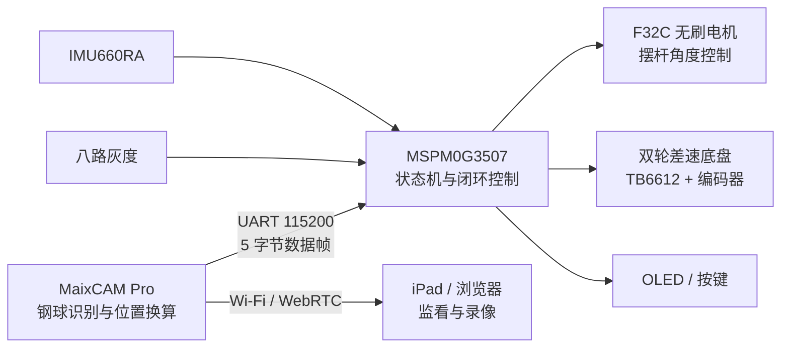

# 2026 全国大学生电子设计竞赛 H 题：车载平衡滚球运动控制系统

本仓库整理自 2026 年全国大学生电子设计竞赛 H 题参赛工程，包含最终上车的
MSPM0G3507 底盘/滚球控制固件、MaixCAM Pro 视觉识别程序、模型、赛题文件与调试资料。

> 项目在原参赛车辆上完成题目 2～6 的全部要求并通过现场测试。控制参数、机械尺寸和
> 视觉标定值与原车强相关；复现到其他车辆时必须重新完成接线核对、视觉标定和 PID 调整。

## 功能概览

- 任务 2：小车循迹一圈并停在 A 点；
- 任务 3：静止状态下控制钢球由中心到 `+5 cm`，再到 `-5 cm`；
- 任务 4：小车从 A 到 B，同时保持钢球在中心；
- 任务 5：小车循迹一圈，同时保持钢球在中心；
- 任务 6：小车循迹一圈，同时保持钢球在任意预设位置；
- MaixCAM 目标检测、位置标定、可选零点、UART 闭环数据输出；
- 固定热点、720p WebRTC 预览以及浏览器录像/回放；
- OLED 状态显示、按键选题/启停、急停与故障锁存；
- 速度环、灰度循迹、IMU 角速度环、S 曲线规划及主机侧单元测试。

## 系统结构



MaixCAM 向 MSPM0 发送固定帧：

```text
7B tracking dx_hi dx_lo 7D
```

其中 `dx` 为大端有符号 16 位整数，单位为 `1/8 cm`；`tracking=0` 时发送零偏差。

## 目录

```text
.
├─ firmware/
│  ├─ mspm0/                 # MSPM0G3507 Keil 工程、依赖和测试
│  └─ maixcam/               # MaixCAM 应用、标定工具和检测模型
├─ docs/
│  ├─ reference/             # H 题赛题 PDF
│  ├─ flowcharts/            # 控制流程图
│  ├─ 比赛现场操作流程.md
│  ├─ MaixCAM_Pro_方案与调试.md
│  └─ MSPM0_底盘固件使用与调试.md
├─ LICENSE
└─ THIRD_PARTY_NOTICES.md
```

旧版本、备份目录、临时测试程序、Python 缓存、Keil `Objects/Listings`、构建日志、
预编译固件及个人 IDE 配置均未纳入仓库；最终参赛源码是本仓库的权威版本。

## 主要硬件

- 主控：MSPM0G3507（天猛星扩展板/逐飞库工程）；
- 视觉：MaixCAM Pro，GC4653 摄像头；
- 底盘：双轮差速，MG513XP28_12V 编码电机，TB6612 驱动；
- 姿态：IMU660RA；
- 循迹：八路灰度传感器；
- 滚球执行器：F32C 串口无刷电机，地址 `2`；
- 人机界面：SSD1306 兼容 OLED、4 个按键；
- 钢球检测模型：`model_310817.cvimodel`。

完整引脚表见 [MSPM0 底盘固件使用与调试](docs/MSPM0_底盘固件使用与调试.md)。

## 快速开始

### 1. MSPM0G3507

1. 安装 Keil MDK 5.37 或兼容版本（原工程使用 ARMCLANG 6.21）。
2. 打开：
   `firmware/mspm0/project/mdk/SeekFree_MSPM0G3507_Device_Library.uvprojx`。
3. 执行全量编译，确认 `0 Error, 0 Warning` 后再烧录。
4. 上电时保持车辆静止，等待 IMU 标定完成、OLED 进入 `READY`。

SysConfig 源文件位于：
`firmware/mspm0/libraries/sdk/ti_config/SeekFree_MSPM0G3507_Device_Library.syscfg`。
不要手工修改自动生成的 `ti_msp_dl_config.*`。

### 2. MaixCAM Pro

1. 使用 MaixVision 打开 `firmware/maixcam/`。
2. 将 `local_config.py.example` 复制为 `local_config.py`，设置至少 8 位的热点密码；
   该文件已被 Git 忽略，不要提交真实密码。
3. 机械安装位置发生变化时，先运行 `calibrate.py` 并完成标定。
4. 正式运行入口为 `main.py`，不要把 `calibrate.py` 当作比赛入口。
5. iPad/电脑连接热点 `MaixBall-AP`，使用本地配置的密码。
6. 打开 `http://192.168.66.1:8080/` 进入录像与零点控制页。

正式运行前确认终端中的 `inference_fps >= 20`、`tracking=1`，并且没有持续出现
UART 或相机读取警告。MaixCAM 侧的详细说明见
[应用说明](firmware/maixcam/README.md)。

### 3. UART 接线

```text
MaixCAM UART1 A19 (TX)  -> MSPM0 PB16 (UART2 RX)
MaixCAM GND             -> MSPM0 GND
波特率：115200，8N1
```

如需双向调试，再将 MaixCAM A18 (RX) 接到 MSPM0 PB15 (UART2 TX)。串口必须交叉连接并共地。

## 测试与校验

在 Windows PowerShell 中运行主机侧测试（需要 `gcc`）：

```powershell
& "firmware/mspm0/tests/run_chassis_state_machine_test.ps1" `
  -ProjectRoot "firmware/mspm0"
```

该脚本只在主机上编译和运行状态机、控制环、驱动抽象、滚球任务、遥测、规划器、
IMU 标定与命令解析测试，不会烧录或访问硬件。

发布文件 SHA-256：

```text
model_310817.cvimodel   586F0FE1181302689F807F98F36242F147694B70255AD884FEFEDB0123054845
```

## 复现前必做

1. 对照引脚表检查电源、电平、共地、UART 交叉连接和电机方向；
2. 根据实车轮径、轮距、传感器位置修正 `car_config.h`；
3. 在最终机械安装状态下重新运行 MaixCAM 五点标定；
4. 架空车轮、移除钢球，先验证急停、方向和限位；
5. 低速逐项验证任务 2～6，再逐步恢复比赛参数；
6. 调试期间随时准备使用 KEY4 急停。

详细的赛场步骤见 [比赛现场操作流程](docs/比赛现场操作流程.md)。

## 安全提示

本项目包含运动机构、电机与闭环控制。参数、接线或机械方向错误可能导致车辆冲出、
摆杆撞限位或器件损坏。首次运行必须架空/限位测试，并确保急停有效。仓库内容按现状
提供，不构成对特定硬件安全性或比赛成绩的保证。

## 许可证

本仓库基于 GPL-3.0-or-later 的逐飞 MSPM0G3507 开源库，整体按
[GNU GPL v3](LICENSE) 发布。TI DriverLib、CMSIS、模型及其他第三方内容仍分别遵循
其原始版权和许可条款，详见 [第三方声明](THIRD_PARTY_NOTICES.md) 及各源文件头部。
