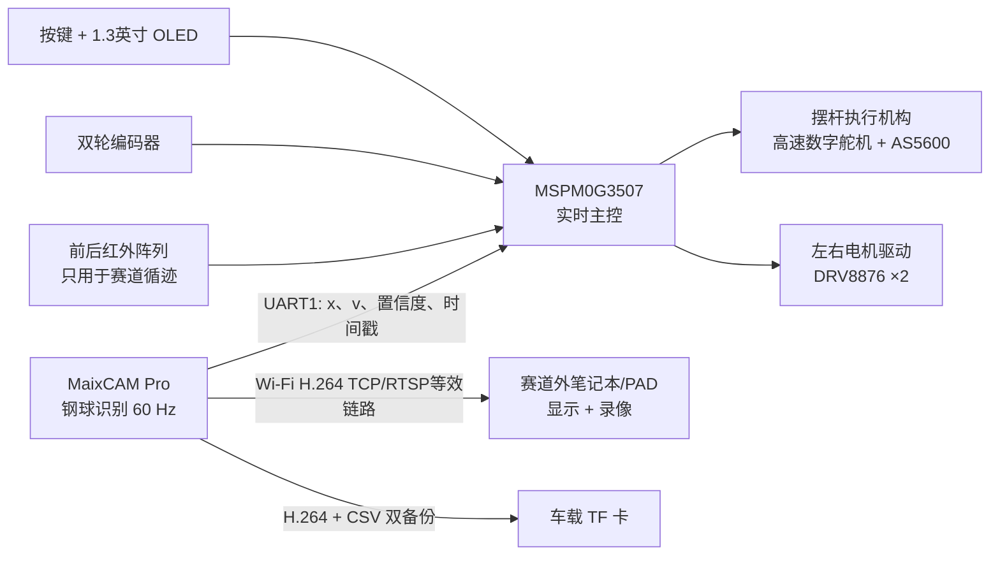
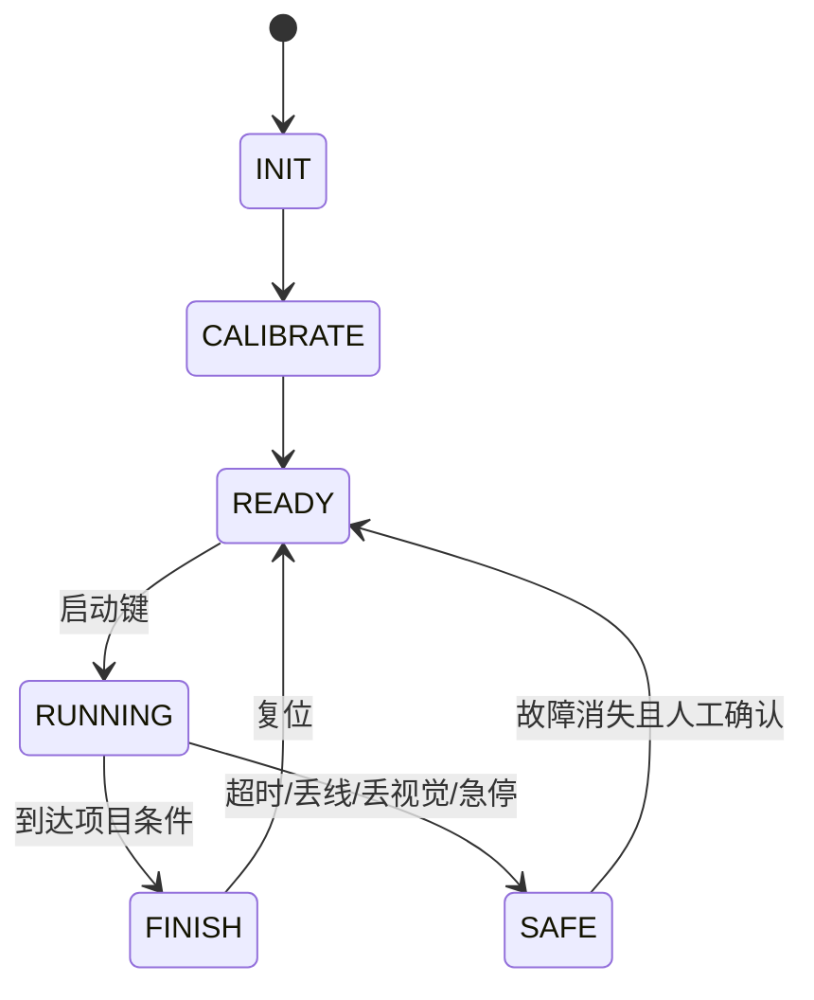

# 2026 H题“车载平衡滚球运动控制系统”完整可落地方案

> 方案版本：V1.0  
> 视觉平台：MaixCAM Pro（MaixPy v4）  
> 实时主控：TI MSPM0G3507  
> 设计目标：优先稳定完成第 1～5 项，在相同硬件上完成第 6 项任意位置保持。

## 1. 题目硬约束与评分目标

### 1.1 题目硬约束

- 车身投影尺寸不得超过 `35 cm × 25 cm`，建议实际做成 `30 cm × 22 cm`。
- 只能采用轮式驱动，必须由车载电池供电。
- 小车循迹只能使用红外光电模块，数量不限；MaixCAM Pro 不得用于赛道循迹。
- 赛道黑线宽 `1.8±0.2 cm`；AB、CD 长 `1.5 m`，两端半圆半径 `0.5 m`，一圈约：

  \[
  L=2\times1.5+2\pi\times0.5\approx6.142\text{ m}
  \]

- A 点启停线长 `5 cm`、宽 `1.8±0.2 cm`，垂直于环线；停止偏差按车上指定测试点到基准线的绝对距离计算。
- 摆杆由长 `25 cm` 的 4 分 PPR 管改造，外径约 `2 cm`、壁厚 `0.34 cm`；钢球直径约 `1 cm`。
- 凹槽内不得粘贴、涂覆或做增摩改造，钢球位置检测必须使用摄像头。
- 摄像头可固定在摆杆上方，但必须随车；接收、显示与存储设备必须位于赛道外。
- 车上必须有启动按键和计时显示，显示屏尺寸不得大于 2 英寸。
- 行驶期间不得人为干预或遥控，车身投影完全脱离轨迹线则本次测试失败。

### 1.2 评分项到工程指标的映射

| 题目项 | 工程目标 | 建议验收余量 |
|---|---:|---:|
| 图传与录像 | 连续显示、完整录像、可回放 | 先本地 TF 双备份，再无线发送 |
| 一圈并停 A | `≤20 s`、停车 `≤2 cm` | 目标 `16～18 s`、停车 `≤1 cm` |
| 静止 +5 cm 到 -5 cm | `≤5 s`、两端误差 `≤1 cm` | 目标 `≤3 s`、稳态误差 `≤4 mm` |
| A 到 B | `≤8 s`、球在 O 附近 `≤1 cm` | 目标 `5～6 s`、误差 `≤6 mm` |
| 一圈中心保持 | `≤30 s`、误差 `≤1 cm` | 目标 `18～22 s`、误差 `≤6 mm` |
| 一圈任意点保持 | `≤30 s`、误差 `≤1 cm` | 任意设定 `-10～+10 cm`，误差 `≤6 mm` |

## 2. 总体架构

系统采用“双处理器、双闭环、双记录”的结构。



### 2.1 为什么 MaixCAM Pro 不直接控制电机

MaixCAM Pro 运行 Linux，摄像头最低采集延迟仍有约几十毫秒，文件系统、无线网络和 Python 任务也会产生调度抖动。它非常适合视觉、编码和通信，但不适合作为唯一的硬实时电机控制器。

MSPM0G3507 负责：

- 1 kHz 双轮速度环；
- 200 Hz 循迹与车体姿态控制；
- 200～333 Hz 摆杆角度执行；
- 50～60 Hz 球位置外环；
- 按键、计时、OLED、故障状态机与看门狗。

MaixCAM Pro 负责：

- 采集整根摆杆画面；
- 估计钢球位置、速度和置信度；
- 通过 UART1 报告测量值；
- H.264/H.265 硬编码；
- 无线发送并在 TF 卡本地备份。

## 3. 机械结构

### 3.1 底盘

- 外形建议：`300 mm × 220 mm`，为题目上限各留至少 25 mm 余量。
- 驱动形式：左右两个带编码器减速电机差速驱动，前后各一只低摩擦万向球。
- 驱动轮轴线尽量靠车体几何中心，轮距建议 `160～180 mm`。
- 轮径建议 `60～70 mm`；减速电机空载输出 `150～200 rpm`。
- 重电池、主控和驱动板全部放低，MaixCAM 支架采用轻质铝型材或碳杆。
- 车上用于判定停车偏差的“指定测试点”应与一只专用向下红外传感器重合。

### 3.2 摆杆

- 严格按题面使用 25 cm PPR 管改造，保留原始内壁，不得在凹槽内粘贴或涂覆。
- 左端采用低间隙金属合页或 3 mm 光轴加双轴承作为转轴。
- 右端采用短连杆驱动，球头连杆两端预紧，避免舵机齿隙直接映射到摆杆。
- 摆杆最大工作角限制为 `±6°～±8°`，机械硬限位设置为 `±10°`。
- 在左端转轴同轴安装 AS5600 磁编码器，实测摆杆角度，不依赖舵机内部位置值。
- 钢球与防滚落挡片之间应留足间隙；挡片不得形成会卡球的台阶。
- 整根摆杆、挡片、连杆不得超出车身投影。

### 3.3 摄像头与照明

- MaixCAM Pro 镜头光轴垂直摆杆中点，安装在刚性 U 形支架上。
- 镜头到摆杆垂直距离建议 `180～230 mm`，使画面横向覆盖约 `28～30 cm`。
- 使用 M12 低畸变镜头，固定焦距和焦环；比赛前用螺纹胶或胶带锁紧焦环。
- 在镜头周围增加漫反射白光环形灯，光线经磨砂扩散片照射，降低钢球镜面反光跳变。
- 加黑色遮光罩隔绝场馆顶灯变化，但遮光罩不得进入车身投影外。
- 镜头、摆杆与支架必须同车刚性连接；用手推动小车时，画面中摆杆端点像素抖动应小于 2 px。

### 3.4 MaixCAM Pro 屏幕的合规处理

MaixCAM Pro 自带 2.4 英寸屏幕，而题目要求车上显示屏不大于 2 英寸。为避免评审争议：

- 比赛车上物理断开并拆下 MaixCAM Pro 的 2.4 英寸屏幕，只保留主板和摄像头；
- MaixCAM 采用无屏自启动；
- 车上计时和模式显示使用独立 `1.3 英寸 OLED`；
- 赛道外笔记本或 PAD 作为图传接收和录像设备。

仅把 2.4 英寸屏幕熄灭或贴黑胶不够稳妥，建议彻底拆离车体。

## 4. 硬件选型与 BOM

| 模块 | 推荐器件/指标 | 数量 | 说明 |
|---|---|---:|---|
| 视觉 | MaixCAM Pro + GC4653 + TF 卡 | 1 | 屏幕拆离，MaixPy v4 |
| 实时主控 | LP-MSPM0G3507 或 MSPM0G3507 最小系统 | 1 | 80 MHz，128 KB Flash，32 KB SRAM |
| 电机 | 12 V 25GA/37GB 编码减速电机，150～200 rpm | 2 | 选同批次并做速度标定 |
| 电机驱动 | DRV8876 | 2 | 单路 H 桥、带电流检测；比 TB6612 留量更足 |
| 驱动轮 | 65 mm 橡胶轮 | 2 | 左右直径误差小于 0.5% |
| 摆杆执行器 | 高速数字金属齿舵机 | 1 | `≥2 kg·cm`、`≤0.10 s/60°`、支持 250～333 Hz |
| 摆杆角度 | AS5600 + 径向磁钢 | 1 | 安装在铰链同轴端 |
| 循迹 | 12～16 路模拟红外反射阵列 | 2 | 前、后各一套，阵列宽 80～100 mm |
| 精停 | 独立红外反射传感器 | 1～2 | 与车上指定测试点同位置 |
| 显示 | 1.3 英寸 128×64 OLED | 1 | 符合不大于 2 英寸 |
| 操作 | 启动键、模式键、加减键、急停键 | 4 | 行驶前设定，行驶中不使用 |
| 电池 | 3S 2200～3000 mAh 锂电 | 1 | 带总开关、保险丝和电压监测 |
| Maix 电源 | 5 V / 3 A 降压 | 1 | 独立 LC 滤波 |
| 舵机电源 | 6～7.4 V / 5 A BEC | 1 | 禁止从 MCU 5 V 给舵机供电 |
| 逻辑电源 | 3.3 V / 1 A | 1 | 主控和传感器 |
| 无线接收 | 5 GHz 路由器/热点 + 笔记本 | 1 | 全部位于环形路线外 |

### 4.1 电源与接地

- 3S 电池分三路：电机母线、舵机 BEC、MaixCAM 5 V。
- 三路仅在电池负极附近单点共地，避免舵机大电流经过摄像头或 MCU 地线。
- 每个 DRV8876 旁放 `470 µF + 1 µF + 100 nF`；舵机接口旁放 `1000 µF` 低 ESR 电容。
- MaixCAM 5 V 输入前加 LC 或磁珠滤波，并给电源线预留锁紧连接器。
- UART 两端必须共地；MaixCAM IO 为 3.3 V，不允许 5 V 直接连接。
- 总电源入口加保险丝和防反接；急停键直接关闭电机驱动 EN，同时让 MCU 进入 SAFE。

## 5. 接口与通信

### 5.1 MaixCAM Pro 与 MSPM0

优先使用 MaixCAM Pro UART1，避免 UART0 的启动日志和启动脚电平问题：

| MaixCAM Pro | 功能 | MSPM0 |
|---|---|---|
| A19 | UART1_TX | MCU_RX |
| A18 | UART1_RX | MCU_TX |
| GND | 信号地 | GND |

- 串口设备：`/dev/ttyS1`
- 电平：3.3 V
- 建议参数：`921600, 8N1`；若现场线缆较长或干扰大，降至 `460800`。
- 线长小于 30 cm，TX/RX 各串 22～47 Ω 电阻。
- 最终 MSPM0 物理引脚必须在 `.syscfg` 中分配并由 SysConfig 生成，不手改 `ti_msp_dl_config.*`。

建议在 MSPM0 SysConfig 中按下表分配资源，具体引脚再根据最终使用的 LaunchPad/自制板封装选择：

| 资源 | 建议用途 | 关键参数 |
|---|---|---|
| UART×1 | MaixCAM Pro 数据链 | 921600 8N1，DMA/环形缓冲接收 |
| TIMA CC×2 | 左右 DRV8876 PWM | 20 kHz，边沿对齐 |
| TIMA/TIMG CC×1 | 数字舵机 PWM | 250～333 Hz，脉宽按实物标定 |
| 1 ms Timer | 系统调度节拍 | ISR 仅置任务标志 |
| GPIO IRQ×4 | 左右编码器 A/B 相 | 双边沿，软件正交解码 |
| ADC0+ADC1 | 前后红外阵列 | 两个 CD74HC4067 同地址并行扫描，DMA |
| ADC 通道×3 | 左右驱动电流、母线电压 | 过流/堵转/欠压保护 |
| I2C×1 | AS5600 + OLED | 400 kHz，地址冲突需先检查 |
| GPIO×4 | MUX 地址线 | 前后阵列共用 |
| GPIO×4 | 启动/模式/加/减 | 消抖后仅 READY 状态有效 |
| GPIO×3 | 驱动 EN/nFAULT/急停 | 急停硬件直达 EN |

### 5.2 视觉数据帧

固定 24 字节，小端，CRC16-CCITT：

| 偏移 | 字段 | 类型 | 含义 |
|---:|---|---|---|
| 0 | 帧头 | `uint16` | `0x5AA5` |
| 2 | 类型 | `uint8` | `0x01` 球状态 |
| 3 | 序号 | `uint8` | 0～255 循环 |
| 4 | 时间戳 | `uint32` | Maix 采集时刻，ms |
| 8 | 位置 | `int16` | `x_mm`，中心为 0 |
| 10 | 速度 | `int16` | `v_mm_s` |
| 12 | 置信度 | `uint16` | 0～1000 |
| 14 | 半径 | `uint16` | 检测圆半径，0.1 px |
| 16 | 延迟估计 | `uint16` | 采集到发送的延迟，ms |
| 18 | 标志 | `uint16` | valid/lost/record/net |
| 20 | 保留 | `uint16` | 后续扩展 |
| 22 | CRC | `uint16` | 前 22 字节 CRC |

MCU 每 20 ms 回传一次 16 字节状态帧，包含工作模式、球目标位置、小车速度、轨迹段、启停状态和故障码。

### 5.3 超时策略

- 视觉帧超过 `100 ms` 未更新：冻结积分、摆杆缓慢回水平，小车降速。
- 超过 `250 ms`：小车停止，摆杆水平，进入 `VISION_LOST`。
- CRC 连续 5 帧错误：清空接收状态机并报警。
- 不以无线网络状态决定实时控制；无线断开时仍允许本地控制和 TF 录像。

## 6. MaixCAM Pro 视觉方案

### 6.1 工作参数

- 摄像头：GC4653。
- 建议采集：`1280×720 @ 60 fps`；若处理负载过高，退到 `640×480 @ 60 fps`。
- `buff_num=1`，降低采集延迟。
- 启动后丢弃前 30 帧。
- 比赛光照下固定曝光、增益和白平衡，禁止运行中自动曝光跳变。
- 曝光尽量控制在 `1～3 ms`，避免车体振动造成运动模糊。
- 只处理摆杆附近窄 ROI，宽度覆盖端点，ROI 高度通常 120～220 px。

### 6.2 标定

1. 小车水平静止，钢球取出。
2. 在画面中人工确认摆杆左端、中心 O、右端以及 `-10、-5、+5、+10 cm` 刻度的像素横坐标。
3. 用 5～7 个标定点拟合：

   \[
   x_\text{mm}=c_0+c_1u+c_2u^2+c_3u^3
   \]

4. 保存 ROI、多项式系数、圆半径范围和曝光参数到配置文件。
5. 放球后依次放到 `-10、-5、0、+5、+10 cm`，视觉读数最大误差应小于 2 mm。

摆杆角度不超过 8° 时，顶视水平投影误差小于约 1%；可用 AS5600 角度做：

\[
x_\text{rail}=x_\text{image}/\cos\theta
\]

### 6.3 球检测算法

不建议一开始训练 YOLO。单目标、固定背景、固定尺度时，经典视觉更快、更可解释。

每帧流程：

1. 读取最新帧并取摆杆 ROI。
2. 转灰度、3×3 高斯滤波。
3. 在预测位置附近优先搜索圆，使用 MaixPy `find_circles` 或 OpenCV `HoughCircles`。
4. 候选圆按半径、凹槽区域、圆形度、边缘强度、预测距离及钢球明暗结构评分。
5. 无可靠圆时，用背景差分或 LAB/灰度 `find_blobs` 作为备选。
6. 一维 α-β 滤波或 Kalman 滤波输出 `x、v`，并进行物理限幅：
   - `x ∈ [-125, 125] mm`
   - `|v| < 1500 mm/s`
7. 连续 3 帧不可信才置 lost，避免单帧反光导致控制跳变。

推荐初始门限：

- 640 宽画面：钢球直径约 18～25 px；
- 1280 宽画面：钢球直径约 36～50 px；
- 候选圆半径容差：标定值的 `±25%`；
- 预测门宽：低速 `±20 mm`，高速按 `|v|` 自适应放宽。

### 6.4 视觉控制接口伪代码

```python
from maix import app, camera, image, time, uart, video

cam = camera.Camera(
    1280, 720,
    image.Format.FMT_YVU420SP,
    fps=60,
    buff_num=1,
)
cam.skip_frames(30)
encoder = video.Encoder(
    width=cam.width(),
    height=cam.height(),
    type=video.VideoType.VIDEO_H264_CBR,
    capture=True,
)
encoder.bind_camera(cam)
serial = uart.UART("/dev/ttyS1", 921600)

while not app.need_exit():
    nal = encoder.encode()
    img = encoder.capture()
    payload = nal.to_bytes(True)
    roi = crop_and_gray(img, config.roi)
    measurement = detect_ball(roi, predicted_x)
    state = kalman_update(measurement, capture_timestamp)
    serial.write(pack_ball_frame(state))
    local_h264.write(payload)
    network_send_nonblocking(payload)
    csv.write(timestamp, state.x, state.v, state.confidence)
```

正式代码应把网络发送放入独立线程或非阻塞队列，网络卡顿不得阻塞视觉与 UART。

## 7. 图传、显示与录像

### 7.1 推荐链路

最稳妥的比赛方案不是让实时控制依赖 RTSP，而是“一次硬编码，两路消费”：

- MaixCAM Pro 对同一摄像头帧进行 H.264 硬编码；
- 编码数据写入车载 TF 卡，作为断网兜底；
- 同一编码数据通过 5 GHz Wi-Fi 发送到赛道外笔记本；
- 笔记本实时播放，同时保存原始 H.264/封装为 MKV 或 MP4；
- 同步保存位置 CSV，比赛后可叠加轨迹和误差曲线。

MaixPy 官方 RTSP 接口在 `bind_camera()` 后原 Camera 对象不能继续用于普通读取，因此不能简单地一边 RTSP 直绑、一边在同一对象上做球检测。若采用 RTSP，应使用经验证的多通道方案；在未验证前，优先采用“Encoder capture + 自定义 TCP 发送”。

### 7.2 无线接收端

- 赛道外放一台 5 GHz 热点/路由器，MaixCAM 与接收笔记本均连接该热点。
- 使用固定 IP 或 mDNS，赛前关闭系统自动更新和其他大流量任务。
- 接收程序启动后先创建录像文件，再显示画面。
- 接收端每秒写一次索引/同步，意外断开时最大只损失最后 1 秒。
- 比赛结束后自动将裸 H.264 无重编码封装为 MP4/MKV，并校验可回放。
- 本地 TF 和接收端文件至少保存一份完整视频；不要只保留缓存流。

## 8. 小车循迹与精停

### 8.1 传感器布局

- 前阵列位于驱动轮轴前方 `80～110 mm`。
- 后阵列位于驱动轮轴后方 `60～90 mm`。
- 两阵列均垂直于车体纵轴，离地 `8～12 mm`。
- 专用精停红外传感器安装在车上指定测试点正下方。
- 传感器红外发射采用同步调制或“亮/灭差分采样”，降低环境光影响。

### 8.2 轨迹误差

对每个阵列做归一化后，用加权质心求黑线位置：

\[
e_f=\frac{\sum_i w_i I_i}{\sum_i I_i},\qquad
e_r=\frac{\sum_i w_i I_i}{\sum_i I_i}
\]

构造：

\[
e_y=(e_f+e_r)/2,\qquad
e_\psi=(e_f-e_r)/L_s
\]

其中 `L_s` 为前后阵列间距。转向命令：

\[
\omega=K_y e_y+K_\psi e_\psi+K_d\dot e_y+\omega_{ff}
\]

左右轮目标速度：

\[
v_L=v-\omega W/2,\qquad v_R=v+\omega W/2
\]

双轮各自采用 1 kHz PI 速度环。

### 8.3 速度规划

一圈 20 s 要求最低平均速度为 `6.1416/20=0.3071 m/s`。为减少钢球受到的纵向
惯性扰动，正常循迹不再切换直线档和弯道档：

- 任务2：全圈 `0.37 m/s` 单一巡航目标；
- 任务4：`0.24 m/s` 单一巡航目标；
- 任务5/6：全圈 `0.25 m/s` 单一巡航目标，理论最低值为 `0.2047 m/s`；
- 起步、终点减速和异常丢线恢复仍经过 S 曲线。

禁止给速度阶跃。规划器同时输出期望加速度，供滚球控制做前馈补偿。

### 8.4 A 点识别与精停

1. 起步后前 `0.5 m` 屏蔽启停线检测，避免把起点黑线误认为终点。
2. 里程超过 `5.5 m` 且运行时间超过 10 s 后，允许识别 A 点。
3. 前阵列检测到“横向多数通道同时变黑”时，进入预刹车，速度降到 `0.05～0.08 m/s`。
4. 位于指定测试点正下方的精停传感器检测到 A 线时，立即主动制动。
5. 编码器再做 20～50 ms 的位置保持，随后关闭驱动。

这样把高速制动和最终定位分开，可将停车误差压到 1 cm 内。

## 9. 滚球控制

### 9.1 简化模型

钢球近似实心球、纯滚动时，沿倾斜摆杆方向的加速度近似：

\[
\ddot{x}\approx\frac{5}{7}\left(g\sin\theta-a_c\cos\theta\right)
\]

其中 `x` 为球相对摆杆中心的位置，`θ` 为摆杆倾角，`a_c` 为小车沿摆杆方向的加速度。小角度下：

\[
\ddot{x}\approx\frac{5}{7}(g\theta-a_c)
\]

因此，小车加减速会直接扰动钢球；仅在静止台架调好的 PID，上车后不加加速度前馈，很容易在起步和刹车时超出 1 cm。

### 9.2 控制结构

外环 50～60 Hz：

\[
e=x_{ref}-x_{pred}
\]

\[
a_b^*=K_p e-K_d\dot{x}+K_i\int e\,dt
\]

\[
\theta^*=\arcsin\left(\frac{7a_b^*/5+a_c}{g}\right)
\]

其中：

- `x_pred = x + v·τ`，`τ` 为视觉测得的总延迟；
- `a_c` 优先取速度规划器的期望加速度，再用轮速差分修正；
- `θ*` 限制为 `±6°～±8°`；
- 积分只在 `|e|<15 mm` 且输出未饱和时启用；
- 设定点变化用限速器，不直接阶跃。

内环 200～333 Hz：

- AS5600 测摆杆角度；
- 舵机内部位置环负责快速执行；
- MCU 外部角度环做线性化和低频修正；
- 舵机命令限速、限幅，并做软启动。

### 9.3 任意位置与 +5 到 -5

- 模式 3：启动前让控制器先稳定在 `+5 cm`；按启动键后生成从 `+5 cm` 到 `-5 cm` 的 S 曲线目标。
- 目标轨迹不要一步跳变，建议最大目标速度 `100～150 mm/s`、最大加速度 `300～500 mm/s²`。
- 到达条件：`|e|<4 mm` 且 `|v|<15 mm/s` 连续 300 ms。
- 模式 6：启动前用加减键选择 `-10～+10 cm`，步进 1 cm；OLED 显示设定值，启动后禁止修改。

### 9.4 初始调参顺序

1. 拆下钢球，标定舵机命令与摆杆角度关系，验证正负方向。
2. 摆杆水平，手动给 `±2°、±4°`，确认球运动方向。
3. 静止台架，关闭积分和小车加速度前馈，只调 `Kp、Kd`：
   - 先加 `Kp` 到能回中心；
   - 再加 `Kd` 抑制越过和振荡；
   - 最后加很小的 `Ki` 消除静摩擦或结构偏置。
4. 调模式 3 的 +5 到 -5。
5. 小车低速直线运行，加入 `a_c/g` 前馈。
6. 调整弯道速度和球环限幅。
7. 最后调任意位置保持。

任何一次只改一个参数，并记录“参数、场景、最大误差、稳定时间、视频文件名”。

## 10. 软件架构与调度

### 10.1 MSPM0 分层

```text
app/
  app_main.c
  app_mode.c
service/
  svc_vehicle.c
  svc_ball_control.c
  svc_safety.c
  svc_timer_display.c
middleware/
  mw_pid.c
  mw_trajectory.c
  mw_vision_protocol.c
driver/
  drv_ir_array.c
  drv_encoder.c
  drv_as5600.c
  drv_motor.c
  drv_servo.c
bsp/
  bsp_uart.c
  bsp_pwm.c
  bsp_adc_dma.c
  bsp_i2c.c
halport/
  halport_mspm0.c
```

`.syscfg` 是时钟、引脚、Timer、ADC、UART、I2C、DMA 和中断的唯一配置源；不手工修改生成的 `ti_msp_dl_config.c/.h`。

### 10.2 调度周期

| 周期 | 任务 |
|---:|---|
| 1 kHz | 编码器采样、左右轮速度 PI、过流/堵转检查 |
| 333/200 Hz | 舵机输出、AS5600 角度环 |
| 200 Hz | 红外阵列扫描完成处理、循迹控制 |
| 50～60 Hz | 视觉包消费、滚球外环 |
| 50 Hz | 状态机、速度规划器 |
| 20 Hz | OLED 刷新、遥测 |
| 1 Hz | 电池、电源、温度和录像剩余空间检查 |

ISR 只搬运数据和置标志，禁止在 ISR 中做打印、浮点视觉协议解析或文件操作。

### 10.3 模式状态机



工作模式：

- `M1`：图传与录像自检；
- `M2`：一圈循迹并停 A；
- `M3`：静止 +5 cm 到 -5 cm；
- `M4`：A 到 B，球保持中心；
- `M5`：一圈，球保持中心；
- `M6`：一圈，球保持任意设定位置。

## 11. 安全与故障处理

- 急停硬件优先级最高，直接关闭电机 EN。
- 开机时电机和舵机输出保持关闭，完成传感器自检后才能使能。
- 舵机命令从水平位置在 500 ms 内斜坡开启。
- 任一轮速度接近零但电流持续过高超过 300 ms，判定堵转。
- 丢线超过 50 ms：减速；超过 200 ms：停车。
- 视觉丢失超过 100 ms：球控制积分冻结并回水平；超过 250 ms：停车。
- 电池欠压时禁止开始新测试。
- 主循环喂独立看门狗；复位后保持驱动关闭，必须重新按启动键。
- 无线断开不立即影响控制，但本地录像失败或 TF 空间不足必须在 READY 阶段报警。

## 12. 分阶段实施计划

### 阶段 A：机械与底盘

1. 做出 30×22 cm 底盘，验证能无摆杆连续跑 20 圈不脱线。
2. 完成前后红外阵列和精停传感器。
3. 达到单圈 `≤18 s`、停车 `≤1 cm`，再装摆杆。

### 阶段 B：静止滚球

1. 安装摆杆、舵机、AS5600 和 MaixCAM 支架。
2. 完成视觉 5 点标定，静态位置误差 `≤2 mm`。
3. 完成 UART 数据链路，丢包率 `<0.1%`。
4. 静止中心保持 60 s，最大误差 `≤5 mm`。
5. 完成 +5 到 -5，时间 `≤3 s`、最大误差 `≤5 mm`。

### 阶段 C：车球联调

1. 低速直线，加入加速度前馈。
2. 单独调起步、匀速、弯道、刹车四段。
3. 完成 A 到 B。
4. 完成一圈中心保持。
5. 完成一圈任意位置保持。

### 阶段 D：图传与证据

1. 接收端连续录像 10 分钟，主动断网再恢复。
2. 验证本地 TF 视频和外部视频均可回放。
3. 每次测试保存：视频、CSV、控制日志、参数版本。
4. 生成最大误差、均方误差、稳定时间、单圈时间和停车偏差表。

## 13. 赛前验收清单

### 13.1 尺寸与合规

- [ ] 车身投影实测不超过 35×25 cm。
- [ ] 摆杆、挡片、连杆全部在车身投影内。
- [ ] MaixCAM 2.4 英寸屏幕已从车上拆除。
- [ ] 车载 OLED 不大于 2 英寸。
- [ ] 循迹只使用红外光电模块。
- [ ] 凹槽内无粘贴、涂覆、增摩或凸起。
- [ ] 摄像头随车，外部接收设备位于赛道外。

### 13.2 功能

- [ ] 按启动键同一时刻启动计时与控制。
- [ ] A 点识别不会在起步时误触发。
- [ ] 单圈时间连续 5 次均小于 19 s。
- [ ] 停车偏差连续 5 次均小于 1.5 cm。
- [ ] 视觉位置五点误差均小于 3 mm。
- [ ] 中心保持最大误差连续 5 次均小于 8 mm。
- [ ] 任意点保持最大误差连续 5 次均小于 8 mm。
- [ ] 接收端和 TF 卡均有完整可回放视频。

### 13.3 故障注入

- [ ] 拔掉 Maix UART，车辆在 250 ms 内安全停车。
- [ ] 遮挡摄像头，摆杆回水平、车辆停车。
- [ ] 抬起一只驱动轮，堵转保护有效。
- [ ] 遮挡赛道黑线，丢线保护有效。
- [ ] 关闭 Wi-Fi，控制不中断且 TF 继续录像。
- [ ] 按急停，电机 EN 硬件关闭。

## 14. 最易失分的风险

1. **MaixCAM Pro 自带 2.4 英寸屏幕留在车上。**  
   这是最明显的合规风险，应物理拆除。

2. **拿 MaixCAM 做赛道循迹。**  
   题目明确只能用红外光电模块；MaixCAM 仅看钢球。

3. **RTSP 绑定后仍尝试在同一 Camera 对象上读图。**  
   官方文档说明绑定后原对象不可再用；需要已验证的多通道方案，或采用 Encoder capture。

4. **只在静止台架调滚球 PID。**  
   起步和刹车的车体加速度会造成明显球偏移，必须限加速度并加前馈。

5. **用普通慢速塑料齿舵机。**  
   齿隙、死区和响应速度会直接造成 1 cm 误差超限。

6. **停车时高速撞线再刹车。**  
   应先由前阵列预刹车，再由位于测试点下方的精停传感器完成最终对线。

7. **无线链路阻塞视觉线程。**  
   控制数据和本地录像优先，无线发送必须非阻塞并可丢帧。

## 15. 官方资料依据

- [MaixCAM Pro 硬件说明](https://wiki.sipeed.com/hardware/zh/maixcam/maixcam_pro.html)
- [MaixPy Camera API 与低延迟设置](https://wiki.sipeed.com/maixpy/doc/en/vision/camera.html)
- [MaixPy UART 使用说明](https://wiki.sipeed.com/maixpy/doc/en/peripheral/uart.html)
- [MaixPy Find Blobs](https://wiki.sipeed.com/maixpy/doc/en/vision/find_blobs.html)
- [MaixPy Image API（含 find_circles）](https://en.wiki.sipeed.com/maixpy/api/maix/image.html)
- [MaixPy 视频录像](https://en.wiki.sipeed.com/maixpy/doc/en/video/record.html)
- [MaixPy RTSP 推流限制](https://wiki.sipeed.com/maixpy/doc/en/video/rtsp_streaming.html)
- [TI MSPM0G3507 产品页](https://www.ti.com/product/MSPM0G3507)
- [LP-MSPM0G3507 用户指南](https://www.ti.com/lit/ug/slau873d/slau873d.pdf)
